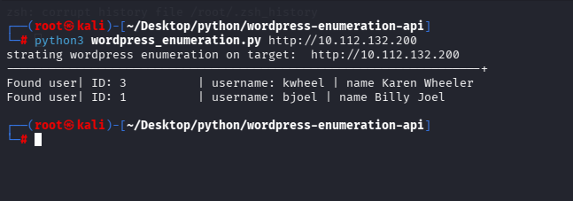

# WordPress REST API Enumeration tool.

## created by **x3bdulaziz**

> [!WARNING]
> Do NOT use this tool against targets without prior written consent and proper authorization.

## ⚠️ Important Note (URL Requirement)
> [!IMPORTANT]
> You **MUST** include the full URL protocol (`http://` or `https://`) with the target. 
> Example: `http://10.114.171.189` or `https://example.com`

## 💡 Note the results
Sometimes the connection may fail or the target might not have a public API, resulting in no vulnerabilities found. If the tool returns no output, please **try running it a few more times** to ensure a stable connection before concluding that the target is secure.

## How to use
## Installation
```bash
pip3 install requests
```


## Run the script form your terminal

```bash
python3 wordpress_enumeration.py <target-url.com>

